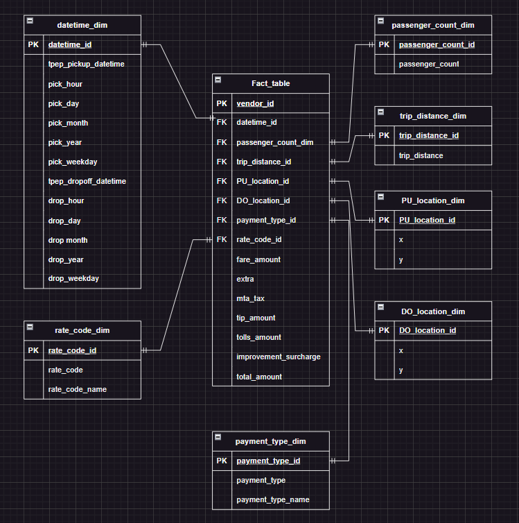
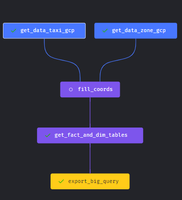

# Yellow Taxi Data Engineering Project

## Data Sources
- [Yellow Taxi Trip Records](https://www1.nyc.gov/site/tlc/about/tlc-trip-record-data.page) - 2022
- [Taxi Zone Numbers](https://data.cityofnewyork.us/Transportation/NYC-Taxi-Zones/d3c5-ddgc)

## Process of Data Engineering
- [x] Download data from the source
- [x] Upload data to Google Cloud Storage
- [x] Decompose data into Third Normal Form (3NF)
- [x] Use Mage-AI to create a Pipeline
- [x] Upload data to Google BigQuery
- [x] Create a Looker Studio Dashboard


## Third Normal Form (3NF)


## Data Engineering Pipeline



## Combining the Monthly data
```shell
python3 data/scripts/combine_data.py
```


## Changing .geojson to .csv
```shell
python3 data/scripts/geospacial_data.py
```

## Locally running Pipeline
```shell
jupyter notebook DataModelling.ipynb
```

## To view Mage Nodes check out [this directory](GCP/mage-scripts/commands)

## Converting 3NF to flat file using SQL, run the script in [this directory](GCP/BigQuery/combine.sql)

[//]: # (List all the technologies used in this project)
# Technologies Used
- [Google Cloud Platform](https://cloud.google.com/)
- [Google BigQuery](https://cloud.google.com/bigquery)
- [Google Cloud Storage](https://cloud.google.com/storage)
- [Mage-AI](https://mage-ai.com/)
- [Looker Studio](https://lookerstudio.google.com/)
- [Python](https://www.python.org/)
- [Jupyter Notebook](https://jupyter.org/)
- [SQL](https://www.mysql.com/)

[Looker Studio Dashboard](https://lookerstudio.google.com/reporting/bfb824f3-b375-491d-b79a-bc3a797bab0b?embed=true)
